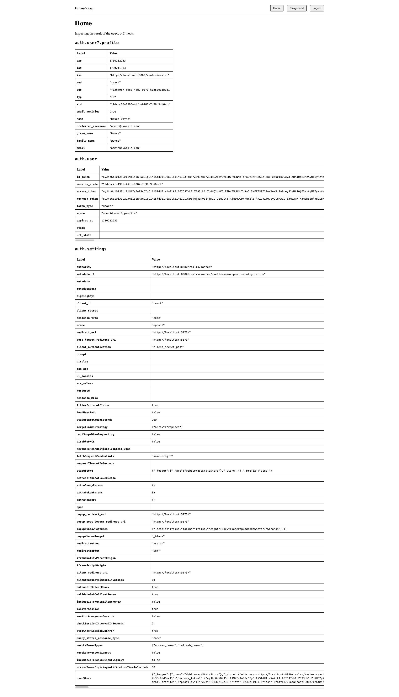

# sample-keycloak-react-oidc-context

Minimal, reproducible example for Keycloak + React.

## Table of contents

<!-- toc -->

- [Screenshots](#screenshots)
- [Why](#why)
- [Setup](#setup)
  * [Docker Compose](#docker-compose)
  * [OPTIONAL: Run React app outside of Docker Compose](#optional-run-react-app-outside-of-docker-compose)
- [Config](#config)
- [Links](#links)
  * [React app](#react-app)
  * [Keycloak account console](#keycloak-account-console)
  * [Keycloak admin console](#keycloak-admin-console)
  * [Mailhog UI](#mailhog-ui)
- [Scenarios](#scenarios)
  * [Cross-tab login/logout](#cross-tab-loginlogout)
  * [API requests with and without token](#api-requests-with-and-without-token)
  * [Register new user](#register-new-user)
- [High-level summary of common flows](#high-level-summary-of-common-flows)
  * [Logging into the React app](#logging-into-the-react-app)
  * [Making an API request](#making-an-api-request)
- [Seeded data](#seeded-data)
  * [Clients](#clients)
  * [Login](#login)
  * [Tokens](#tokens)
  * [Email](#email)
- [Sharing](#sharing)
- [Disclaimers](#disclaimers)
- [History](#history)
- [Contributing](#contributing)
- [Releases](#releases)

<!-- tocstop -->

## Screenshots

Screenshots

**Login**:

**Home**:

**Playground**:

## Why

I often see questions in the [Keycloak forums](https://keycloak.discourse.group) on how to use it with React. On the other hand, I often see questions in the [react-oidc-context repo](https://github.com/authts/react-oidc-context) on how to use it with Keycloak.

So, I thought it'd be cool to make a little project that glues these tools together, in hopes that others may play with it and get ideas for their own implementations.

> The noblest pleasure is the joy of understanding. - Leonardo da Vinci

## Setup

In one terminal, run the Postgres database, Keycloak server, Mailhog server, Express API, and React app via Docker Compose.

**OPTIONALLY**, in another terminal, you may run the React app outside of Docker Compose.

### Docker Compose

1. Install [Docker](https://docs.docker.com/get-docker/)
1. Copy file `.env.sample` to file `.env`

        cp .env.sample .env

1. Build images

        docker compose build

1. Run containers

        docker compose up

1. Wait until you see a message from the Keycloak server like this: _Running the server in development mode. DO NOT use this configuration in production._
1. See [links](#links) for username and password

### OPTIONAL: Run React app outside of Docker Compose

Optional steps

1. Stop the React app container

        docker compose stop react

1. Install [Node.js](https://nodejs.org/en)
1. Change to `react` folder

        cd react

1. Create file `.env.local` with contents

        VITE_PORT=5173
        VITE_AUTHORITY=http://localhost:8080/realms/master
        VITE_CLIENT_ID=react
        VITE_API_BASE_URL=http://localhost:5174

1. Install packages

        npm install

1. Start dev server

        npm run dev

1. See [links](#links) for username and password

## Config

The Docker Compose config should work as-is. If you need to customize it, then edit file `.env`

## Links

### React app

- **Link**: http://localhost:5173
- **Username**:

      admin@example.com

- **Password**:

      juggle-prance-shallot-wireless-outlet

### Keycloak account console

- **Link**: http://localhost:8080/realms/master/account/
- **Credentials**: _same as React app_

### Keycloak admin console

- **Link**: http://localhost:8080/admin/master/console/
- **Credentials**: _same as React app_

### Mailhog UI

- **Link**: http://localhost:8025

## Scenarios

Here are some scenarios you can play with:

### Cross-tab login/logout

1. Login to the React app
1. Copy-paste the link into another browser tab
1. Notice how you're automatically logged in
1. Logout in one of the browser tabs
1. Notice how you're automatically logged out of both browser tabs

### API requests with and without token

1. Login to the React app
1. Open your browser **DevTools**, go to the **Network** tab, and filter requests by **Fetch/XHR**
1. Go to the **Playground** page in the React app
1. Notice how the request **without** a Bearer token gets a 401, but the request **with** a Bearer token gets a 200

### Register new user

1. Go to the login page
1. Click **Register**
1. Fill out the fields for a fake user
1. Click **Register**
1. Open the Mailhog UI
1. Click the email from `no-reply@example.com` with subject **Verify email**
1. Click the **Link to e-mail address verification**
1. Notice how you're automatically logged into the React app with your newly created user

## High-level summary of common flows

### Logging into the React app

Thankfully the [react-oidc-context](https://github.com/authts/react-oidc-context) and [oidc-client-ts](https://github.com/authts/oidc-client-ts) libraries do the heavy lifting for us.

This flow is known as [Authorization Code Grant with Proof Key for Code Exchange (PKCE)](https://github.com/authts/oidc-client-ts/blob/main/docs/protocols/authorization-code-grant-with-pkce.md).

You can see this happen for yourself by doing: Open your browser **DevTools**, go to the **Network** tab, check **Preserve log**, and filter requests by **Doc** and **Fetch/XHR**.

I've copied the request _query params_ and _form data_ directly from DevTools for education purposes. Keep in mind that these values will likely be different for you.

1. Go to the React app
    - **Request URL**:

          GET http://localhost:5173/

1. The OpenID config is fetched
    - **Request URL**:

          GET http://localhost:8080/realms/master/.well-known/openid-configuration

    - **Response body**: _Omitted for brevity. Go to the request URL to see it_
1. You're not logged in, so you're redirected to the Keycloak login page
    - **Request URL**:

          GET http://localhost:8080/realms/master/protocol/openid-connect/auth

    - **Request query params**:

          client_id: react
          redirect_uri: http://localhost:5173/
          response_type: code
          scope: openid
          state: 391fb773c982414baed2250583113efc
          code_challenge: K-Hp16LIAH8r6QSjOmfYh7zJtySFjWFRsVN-4s72st0
          code_challenge_method: S256

1. Submit your username and password
    - **Request URL**:

          POST http://localhost:8080/realms/master/login-actions/authenticate

    - **Request query params**:

          session_code: NSBRN5i4WCHlUNM-Fr_7sVGv_luCqlcuj-dYvRgPGbg
          execution: 0c75cc68-1058-49a7-bdaa-d0f8ec69c1b8
          client_id: react
          tab_id: 1x0hcfo9RVk

    - **Request form data**:

          username: admin@example.com
          password: juggle-prance-shallot-wireless-outlet
          credentialId:

1. On success, you're redirected to the React app
    - **Request URL**:

          GET http://localhost:5173/

    - **Request query params**:

          state: 391fb773c982414baed2250583113efc
          session_state: 683043bb-2209-47ff-b0a5-2c0197ab2507
          iss: http://localhost:8080/realms/master
          code: 44891f5f-be56-4fc4-b970-8f1dd0d88fbe.683043bb-2209-47ff-b0a5-2c0197ab2507.acc4f3dc-25c9-4716-bfa5-cde9f19c8c32

1. The token is fetched
    - **Request URL**:

          GET http://localhost:8080/realms/master/protocol/openid-connect/token

    - **Request form data**:

          grant_type: authorization_code
          redirect_uri: http://localhost:5173/
          code: 44891f5f-be56-4fc4-b970-8f1dd0d88fbe.683043bb-2209-47ff-b0a5-2c0197ab2507.acc4f3dc-25c9-4716-bfa5-cde9f19c8c32
          code_verifier: d8df056c73d6437fa810e3a85f1784761ac3a8001b734dc593fef211ffdba501c0c82b6abeab4b989eb03fae34ad36c4
          client_id: react

    - **Response body**: _`access_token`, `refresh_token`, and `id_token` values truncated for brevity_

          {
              "access_token": "eyJ...",
              "expires_in": 300,
              "refresh_expires_in": 1800,
              "refresh_token": "eyJ...",
              "token_type": "Bearer",
              "id_token": "eyJ...",
              "not-before-policy": 0,
              "session_state": "683043bb-2209-47ff-b0a5-2c0197ab2507",
              "scope": "openid email profile"
          }

### Making an API request

1. Go to the React app, login, then click the **Playground** page
1. An API request is made, which the Vite dev server proxies to the correct location on the API server
    - **Request URL**:

          GET http://localhost:5173/api/payload

    - **Request headers**: _Only relevant headers are included. The access token value is truncated for brevity_

          authorization: Bearer eyJ...

1. The API server receives the request. The token is parsed from the `authorization` header
1. The API server requests the JSON web key set
    - **Request URL**:

          GET http://localhost:8080/realms/master/protocol/openid-connect/certs

    - **Response body**: _Omitted for brevity. Go to the request URL to see it_
1. The [jose](https://github.com/panva/jose) library consumes the JSON web key set, then uses it to verify the token
1. The API server responds to the React app

## Seeded data

The `db/init` folder contains SQL which is copied into the Postgres image and runs on container startup.

I didn't write this SQL by hand. Instead, I customized the `master` realm a tad, then dumped the data. See `compose.jobs.yml`

### Clients

Create a public client with:

- **General settings** > set **Client ID** to `react`
- **Access settings** > set **Valid redirect URIs** to `http://localhost:5173/*`
- **Access settings** > set **Valid post logout redirect URIs** to `http://localhost:5173/*`
- **Access settings** > set **Web origins** to `*`
- **Authentication flow** >  check **Standard flow**
- **Authentication flow** > check **Direct access grants**
- **Logout settings** > check **Front channel logout**
- **Logout settings** > check **Backchannel logout session required**

### Login

- **Realm settings** > **Login** > check **User registration**
- **Realm settings** > **Login** > check **Forgot password**
- **Realm settings** > **Login** > check **Remember me**
- **Realm settings** > **Login** > check **Email as username**
- **Realm settings** > **Login** > check **Login with email**
- **Realm settings** > **Login** > check **Verify email**

### Tokens

- **Realm settings** > **Tokens** > set **Access Token Lifespan** to `5 mins`

### Email

- **Realm settings** > **Email** > set **From** to `no-reply@example.com`
- **Realm settings** > **Email** > set **Host** to `mailhog`
- **Realm settings** > **Email** > set **Port** to `1025`

## Sharing

Places where this project has been shared.

- The [Keycloak forums](https://keycloak.discourse.group/t/minimal-reproducible-example-for-keycloak-react/25664)
- The [react-oidc-context repo](https://github.com/authts/react-oidc-context/issues/1208)

## Disclaimers

- The `Dockerfile` for each service is optimized for local development mode. **DO NOT** use this configuration in production
- For convenience, the admin user is also used for regular app logins. In production, the admin account would be locked down, and you'd have regular, _non-admin_ users

## History

This repo originally lived at [zach-betz-hln/mre-keycloak-react](https://github.com/zach-betz-hln/mre-keycloak-react). For context, see this [issue](https://github.com/authts/react-oidc-context/issues/1208).

## Contributing

1. Create a branch from `main`, or a fork of this repo
1. Make your changes
1. Run through the **Setup** steps in this doc from scratch and confirm everything works
1. Run the dump job

        docker compose -f compose.yml -f compose.jobs.yml run dump

1. PR your changes to be reviewed

## Releases

1. Create a branch from `main`
1. Increment the [semantic version](https://docs.npmjs.com/about-semantic-versioning). `{semver}` should be one of: `major` | `minor` | `patch`

        npm --no-git-tag-version version {semver}

1. Update `CHANGELOG.md` with a new section
1. PR your changes to be reviewed. Put the new semantic version in the PR title
